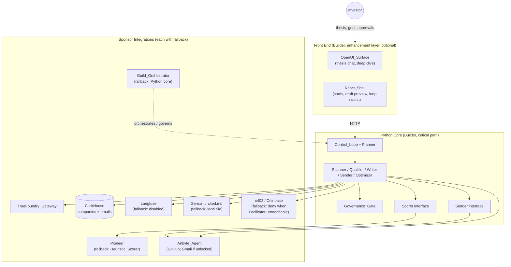
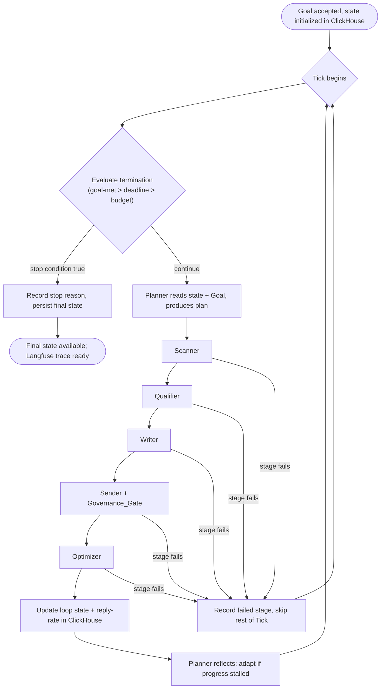
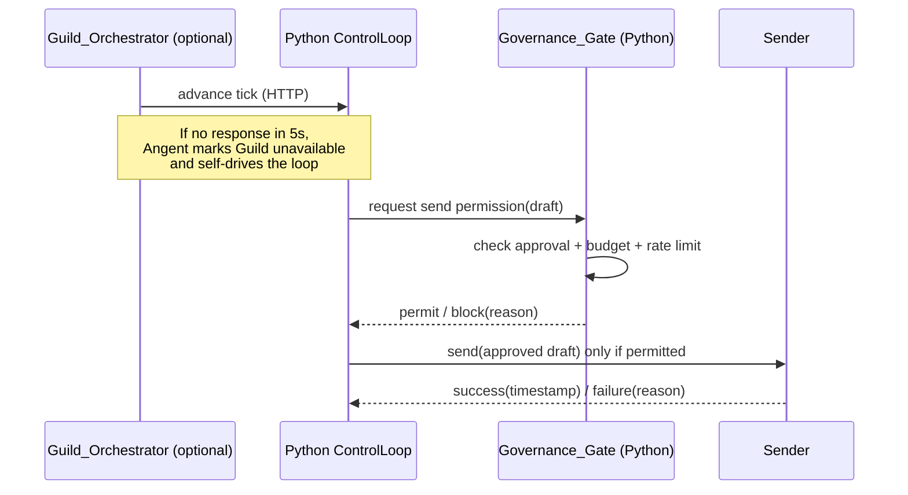
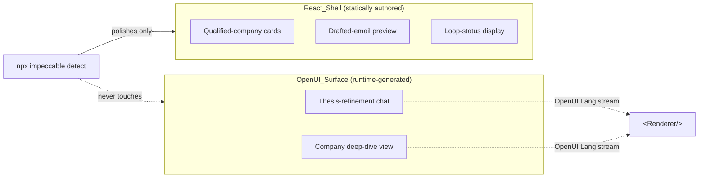
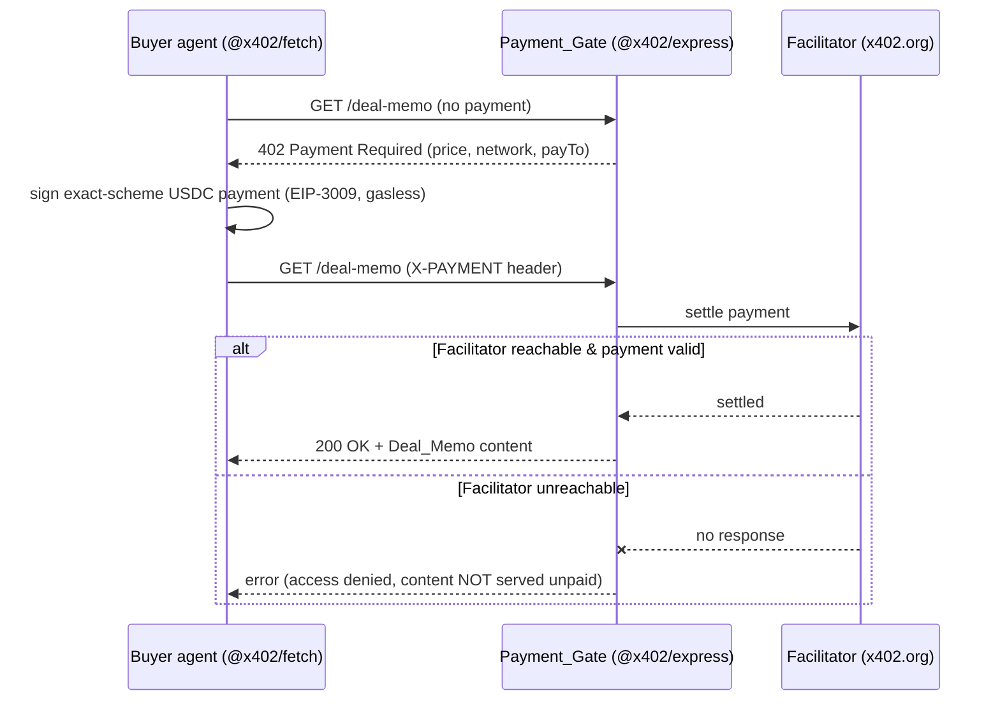

# Design Document

## Overview

Angent is a self-improving, goal-driven deal-sourcing agent for solo angel investors. The investor states an investment thesis and a measurable goal `{ target_metric, deadline, email_budget }`; Angent then runs a continuous control loop that discovers emerging startups from public signals (GitHub via Airbyte, Hacker News via Algolia, Hugging Face as a stretch), qualifies them against the thesis, drafts personalized outreach, sends only after human approval, and learns from reply outcomes to improve qualification over time.

The architecture is a **goal-driven control loop**, not a one-pass pipeline. A **Planner** re-decides each iteration (Tick) based on progress toward the goal. Six cooperating agents — Planner, Scanner, Qualifier, Writer, Sender, Optimizer — operate over a shared **ClickHouse blackboard**. The loop terminates when the goal is met, the time budget elapses, or the email budget is spent.

The design follows three engineering principles drawn from the requirements:

1. **Python core is the critical path; everything else is an enhancement with an explicit fallback.** A single developer — the Builder — owns the whole system and builds critical-path-first: the runnable Python core (signal ingestion through Sender output to termination) comes first, and only then the enhancement layers (Requirement 11, 16, 17). Each sponsor integration — Guild governance, Pioneer scoring, Airbyte Gmail send, OpenUI generative UI, Langfuse tracing — is layered on behind an interface or feature flag so that no single integration can block the demo, and the loop always runs end-to-end on the Python core even while an enhancement layer is incomplete.
2. **Stable interfaces hide optional dependencies.** A single `Scorer` interface backs both Pioneer and the Heuristic_Scorer (Requirement 7); a single `Sender` interface backs both SMTP and the Airbyte Gmail connector (Requirement 10); a single `Governance_Gate` is enforced in the Python core and optionally wrapped by the Guild orchestrator (Requirement 9, 11).
3. **Governance is non-bypassable.** No email is sent without an explicit, still-valid human approval, and budget/rate caps are hard limits enforced before every send (Requirement 9).

This document covers research-informed decisions about the control loop, the agent contracts, the ClickHouse schema, the scorer and sender interfaces, the governance gate, TrueFoundry gateway usage, Langfuse observability, and the OpenUI vs. plain-React UI split. It also defines the continuous version-control workflow against the GitHub repository and the lean, test-harness-free verification approach.

Beyond discovering and qualifying deal flow, Angent now also **publishes** its output to the open web and **transacts** on it, satisfying the challenge verbs "publish" and "transact". The **Publisher** serializes each run's qualified companies into a Deal_Memo and publishes it to cited.md via Senso so the agent's findings are citable with provenance (Requirement 20); the **Payment_Gate** wraps the deal-memo fetch endpoint with an x402 pay-per-fetch paywall so other agents pay per fetch in testnet USDC (Requirement 21). Like every other sponsor integration, each of these is layered behind an explicit fallback — Senso falls back to a local file when unreachable, and the Payment_Gate denies access (rather than serving unpaid) when the Facilitator is unreachable — so neither can block the demo.

### Research Notes and Key Findings

The following findings, gathered from the existing codebase and sponsor APIs, inform the design:

- **Airbyte auth is a two-step OAuth client-credentials flow.** `test_airbyte.py` and `check_connectors.py` confirm the working pattern: `POST https://api.airbyte.com/v1/applications/token` with `client_id`/`client_secret`/`grant_type=client_credentials` returns a bearer token, then the Agents API at `https://api.airbyte.ai/api/v1/integrations/connectors` is called with `Authorization: Bearer` plus `X-Organization-Id`. GitHub discovery is the confirmed path; Gmail send depends on a tier unlock, which is why it is treated as an alternate backend, not the default.
- **SMTP is the reliable default sender.** `angent/email_sender.py` already implements a Windows-friendly Gmail SMTP send over `smtplib.SMTP_SSL("smtp.gmail.com", 465)` using a Gmail App Password (`GMAIL_ADDRESS` / `GMAIL_APP_PASSWORD`) and returns a result dict. This becomes the reference implementation of the `Sender` interface and the default backend.
- **TrueFoundry is an OpenAI-compatible gateway.** The env template provides `TRUEFOUNDRY_API_KEY` / `TRUEFOUNDRY_BASE_URL`, and the front-end `route.ts` already drives an OpenAI-compatible client against a Bedrock-backed model id (`bi-beta-bedrock/global.anthropic.claude-sonnet-4-6`). All LLM reasoning and email prose route through this gateway using the OpenAI SDK with a custom `base_url`.
- **OpenUI generates UI at runtime from a component library.** Per the bundled `openui` skill and the scaffolded `genui-chat-app`, the pipeline is `Component Library → library.prompt() system prompt → LLM stream of OpenUI Lang → Parser → <Renderer />`. This is the mechanism for the agent-decided surfaces (thesis-refinement chat, deep-dive view). The plain dashboard cards stay as statically authored React so Impeccable can polish them without touching generated markup.
- **ClickHouse is the analytical store of record.** Connection is via host/port 8443/user/password/database from the env template (ClickHouse Cloud HTTPS interface). It backs both the operational blackboard and the reply-rate analytics.

## Architecture

### System Context



### The Goal-Driven Control Loop

The loop is owned by the Planner and runs Ticks until a termination condition is met. Each Tick re-evaluates strategy rather than executing a fixed plan.



Key control-loop rules (from Requirements 2, 3, 11):

- **At most one Tick at a time.** Ticks are strictly sequential; loop state is read at the start and written at the end of each Tick.
- **Termination is checked first, every Tick**, before any other action. If multiple conditions hold simultaneously, exactly one stop reason is reported in priority order: `goal-met` > `deadline-reached` > `email-budget-exhausted`.
- **Stage failure is contained to its Tick.** If any of the five pipeline stages fails, the loop stops the remaining stages for that Tick, records the failed stage, preserves prior state, and proceeds to the next Tick.
- **Planner adaptation.** When the improvement in `target_metric` stays below a configured threshold across N consecutive Ticks, the Planner must change at least one of {thesis breadth, email angle, send volume} on the next Tick.

### Orchestration: Python core with optional Guild wrapper

The Python `ControlLoop` runs all six agents in sequence with no dependency on Guild. When the `Guild_Orchestrator` is deployed, it orchestrates the loop by calling the Python backend over HTTP and enforces the governance decisions; if it is absent or does not respond within 5 seconds, Angent classifies it as unavailable and continues using the Python core's own `Governance_Gate`. This guarantees Requirement 11's "Guild problem never blocks the demo."



### Technology Stack

| Concern | Choice | Rationale / Fallback |
| --- | --- | --- |
| Core language | Python 3.11+ | Critical path; existing `email_sender.py` is Python |
| LLM access | OpenAI SDK against TrueFoundry base URL | Requirement 18.3; OpenAI-compatible gateway |
| State + analytics | ClickHouse Cloud (HTTPS 8443) via `clickhouse-connect` | Requirement 12 store of record |
| Scoring | `Scorer` interface: Pioneer ⟶ Heuristic_Scorer | Requirement 7 fallback |
| Sending | `Sender` interface: SMTP (default) ⟶ Airbyte Gmail (if unlocked) | Requirement 10 |
| Orchestration/governance | Python core ⟶ Guild wrapper | Requirement 11 fallback |
| Tracing | Langfuse SDK ⟶ disabled-with-log | Requirement 13 fallback |
| Generative UI | OpenUI Lang + `<Renderer/>` in Next.js | Requirement 14 |
| Static UI | Plain React components | Requirement 15; Impeccable-polishable |
| Signal ingestion | Airbyte Agents API (GitHub), HN Algolia API, HF Hub (stretch) | Requirement 4 |
| Publishing | Senso CLI `senso engine publish` → cited.md | Requirement 20; fallback: local file when Senso unreachable |
| Monetization | x402 (`@x402/express` seller on Base Sepolia testnet `eip155:84532`; facilitator `https://x402.org/facilitator`) | Requirement 21; fallback: deny when Facilitator unreachable |
| Version control | Git + GitHub (https://github.com/Jiyungi/angent), `main` branch, commit-per-change | Requirement 22 |

## Components and Interfaces

### Control Loop and Planner

```python
@dataclass
class Goal:
    target_metric: float        # e.g. target reply rate in [0,1] or contacted-fit count
    deadline: datetime          # wall-clock stop time
    email_budget: int           # hard cap on emails, 1..1000

@dataclass
class LoopState:
    run_id: str
    goal: Goal
    started_at: datetime
    tick_index: int
    emails_sent: int
    reply_rate: float
    thesis_breadth: float       # planner-tunable knob
    email_angle: str            # planner-tunable knob
    send_volume: int            # planner-tunable knob
    metric_history: list[float] # target_metric per tick, for stall detection
    status: Literal["running", "stopped"]
    stop_reason: Optional[StopReason]

class StopReason(str, Enum):
    GOAL_MET = "goal-met"
    DEADLINE_REACHED = "deadline-reached"
    EMAIL_BUDGET_EXHAUSTED = "email-budget-exhausted"

class Planner:
    def plan(self, state: LoopState) -> TickPlan: ...
    def reflect(self, state: LoopState, outcomes: TickOutcome) -> LoopState: ...

class ControlLoop:
    def start(self, thesis: str, goal: Goal) -> RunHandle: ...
    def evaluate_termination(self, state: LoopState, now: datetime) -> Optional[StopReason]: ...
    def run_tick(self, state: LoopState) -> TickOutcome: ...
```

`evaluate_termination` is a **pure function** central to correctness: given state and a clock, it returns the single highest-priority stop reason, or `None` to continue. It is the first thing each Tick calls.

### Goal Validation

A pure validator gates loop initiation (Requirement 1):

```python
def validate_goal(thesis: str, goal_input: dict) -> ValidationResult:
    # thesis length 1..5000
    # required fields: target_metric, deadline, email_budget
    # email_budget in 1..1000
    # deadline between now+1min and now+365days
    # returns ok=True or ok=False with the specific offending field
```

On success the loop persists the Goal + start time + initial state to ClickHouse within 2 seconds and before the first Tick; if that persistence fails, the loop is not started and no partial record is left.

### Scanner

```python
class Scanner:
    def scan(self, plan: TickPlan) -> list[Candidate]: ...

class SignalSource(Protocol):
    name: str                                   # "github" | "hackernews" | "huggingface"
    def fetch(self, plan: TickPlan, since: datetime) -> list[Candidate]: ...
```

- GitHub via `Airbyte_Agent` (repo/stargazer/commit signals), HN via Algolia API (`Show HN`, `Launch HN`), HF Hub stretch — each limited to activity within the most recent 90 days and a 30-second per-source timeout.
- Each source request retries up to 3 times; on total failure the Scanner records a failure entry, continues with remaining sources, and still completes the Tick.
- New candidates are inserted into `companies`; matches on the source-specific unique id are **upserted**, preserving the original `created_at`.

### Qualifier

```python
class Qualifier:
    def qualify(self, candidates: list[Candidate], thesis: str,
                scorer: Scorer, threshold: int) -> list[Qualified]: ...
```

- Produces a numeric fit score in `[0,100]` per candidate within 30 seconds, plus a 50–1000 char natural-language explanation referencing the thesis (via TrueFoundry). If the gateway times out at 30s, store the score with an "explanation unavailable" placeholder and keep the record.
- Score comes from the active `Scorer` (Pioneer when reachable within its timeout, else Heuristic_Scorer).
- Candidates with score ≥ threshold are passed to the Writer; those below are not.

### Scorer Interface (Pioneer / Heuristic, pluggable)

```python
class Scorer(Protocol):
    def score(self, candidate: Candidate, thesis: str) -> int:   # always clamped to [0,100]
        ...
    def learn(self, outcomes: list[Outcome]) -> LearnResult:
        ...

class HeuristicScorer:   # default, always available — keyword/recency/signal-weight blend
    ...

class PioneerScorer:     # optional; Fastino adaptive inference
    ...

def select_scorer(env: Env) -> Scorer:
    # Pioneer if credentials present & reachable, else HeuristicScorer (record mode)
```

Both implementations share identical signatures and return structures (Requirement 7.1). The Qualifier and Optimizer never branch on the concrete scorer type. Per-candidate Pioneer timeout is 10 seconds; on timeout the Qualifier falls back to the Heuristic_Scorer **for that candidate only**, records the fallback, and continues the Tick.

### Writer

```python
class Writer:
    def draft(self, qualified: list[Qualified], plan: TickPlan,
              remaining_budget: int) -> list[Draft]: ...
```

- Drafts exactly one personalized email per qualified candidate, up to the remaining email_budget, via TrueFoundry, incorporating the candidate's signals and the plan's email angle.
- Cumulative drafts in a Tick never exceed remaining budget; if remaining budget is 0, no drafts are produced.
- Each draft is stored in `emails` as **unsent and unapproved**.
- If the gateway fails/times out (30s) for a candidate, skip it without consuming budget, retain completed drafts, and record the failure.

### Governance Gate

```python
class GovernanceGate:
    def approve(self, draft_id: str, investor_id: str) -> ApprovalResult: ...
    def on_draft_modified(self, draft_id: str) -> None:    # reverts to unapproved
    def authorize_send(self, draft: Draft, sent_count: int,
                       budget: int, window: RateWindow) -> SendDecision: ...
```

`authorize_send` is a pure decision function returning `PERMIT` or `BLOCK(reason)`:

- Block if the draft is not currently approved.
- Block (`email-budget`) if sending would make `sent_count + 1 > budget`.
- Defer (`rate-limit`) while sends in the current window ≥ configured limit; if deferred > 3600s, surface a pending indication.
- Modifying an approved draft reverts it to unapproved and requires fresh approval.

The Guild orchestrator, when present, routes **every** send through this gate and rejects any send the gate did not permit; the Python core enforces the same gate when Guild is unavailable.

### Sender Interface (SMTP default / Gmail alternate)

```python
@dataclass
class SendResult:
    ok: bool
    sent_at: Optional[datetime] = None
    error: Optional[str] = None

class Sender(Protocol):
    def send(self, draft: Draft) -> SendResult: ...   # success+timestamp OR failure+reason

class SmtpSender:        # default — wraps angent/email_sender.py
    ...
class GmailAgentSender:  # alternate — Airbyte Gmail connector, only if tier unlocked
    ...
```

- Default backend is `SmtpSender` when none is explicitly selected.
- On success: mark the `emails` record `sent` with the returned timestamp.
- 30-second send timeout ⟶ treat as failed, record reason, leave eligible-for-retry.
- A failure result does **not** decrement email_budget and leaves the draft eligible for retry.
- After 3 consecutive failed attempts, mark the record `failed` and remove from retry eligibility.

### Optimizer

```python
class Optimizer:
    def collect(self) -> list[Outcome]: ...                 # reply / open outcomes
    def store(self, outcomes: list[Outcome]) -> StoreResult: ...
    def feed(self, scorer: Scorer, outcomes: list[Outcome]) -> LearnResult: ...
    def compute_reply_rate(self, run_id: str) -> float: ...  # replies / emails sent
```

- Stores each outcome against its email + company records within 5 seconds; on failure, retries 3× and retains unstored outcomes for the next cycle.
- Feeds newly stored outcomes to the active scorer as learning signal before the next Tick. If Pioneer update fails, keep the previous model and continue scoring with it.
- Computes reply-rate = replies / emails sent for the run and persists it so the trend is observable across Ticks.

### Observability (Langfuse)

A thin tracing wrapper records a trace per agent step (step id, input, output, start/end timestamps) within 2 seconds of completion, and records each TrueFoundry LLM call as a linked span (prompt, response, token count). If Langfuse is not configured at startup, the loop runs untraced and logs that tracing is disabled; if a trace/span write fails after 3 retries, the step continues uninterrupted and the failure is logged.

### UI Surfaces: OpenUI vs. React Shell



- **OpenUI_Surface**: thesis-refinement chat and on-demand deep-dive are generated at runtime via OpenUI Lang (5-second budget each; on failure/timeout retain last good state and show an error). Every rendered element comes from the generation step — nothing hardcoded — and each generated view includes at least one input/action element. This reuses the existing `genui-chat-app` pipeline (`library.prompt()` ⟶ `/api/chat` ⟶ `<Renderer/>`).
- **React_Shell**: dashboard cards, draft preview, loop-status are plain React with no OpenUI Lang markup, kept unambiguously separate so Impeccable polishes only these and leaves generated components untouched.
- **Front end is optional** (Requirement 16): every stage (progress, qualifications, drafts, sends, reply-rate trend) emits a timestamped, stage-identified record to backend logs/console within 2 seconds, so the loop demos from logs alone if the UI is unfinished.

### Publisher (cited.md via Senso)

The Publisher turns a run's qualified companies into a citable open-web artifact. It reads the **same** ClickHouse company data the OpenUI deep-dive consumes (name, URL, source, fit_score, fit_explanation, signals), serializes it to a Deal_Memo markdown document with a provenance citation per company, and publishes via the Senso CLI. It runs when the Optimizer completes a Tick or the run ends, and is strictly non-blocking (Requirement 20.5, 18.13).

```python
@dataclass
class PublishResult:
    ok: bool
    url: Optional[str] = None       # cited.md/<handle>/<slug> on success
    slug: Optional[str] = None
    local_path: Optional[str] = None  # set when the local-file fallback is used
    error: Optional[str] = None

class Publisher:
    def serialize(self, companies: list[Qualified]) -> str:
        # Emits a Deal_Memo: markdown with one section per company carrying
        # name, URL, source, fit_score, fit_explanation, signals, AND a
        # provenance citation linking to the company's real source URL
        # (GitHub repo or Hacker News post). Requirement 20.1, 20.2.
        ...

    def publish(self, deal_memo: "DealMemo") -> PublishResult:
        # success -> PublishResult{ok=True, url, slug}
        # failure -> local-file fallback -> PublishResult{ok=False, local_path, error}
        ...
```

- **Senso call.** Publication invokes the Senso CLI with the Deal_Memo markdown:

  ```bash
  senso engine publish --data '{ "geo_question_id": "<id>", "raw_markdown": "<markdown>", "seo_title": "<title>", "summary": "<summary>" }'
  ```

  authenticated with `SENSO_API_KEY` (format `tgr_...`) against `SENSO_BASE_URL=https://apiv2.senso.ai/api/v1`. A cited.md entry has the schema `title, handle, slug, body, tags, provenance` and is served at `cited.md/<handle>/<slug>` as human HTML plus an agent-native payload (structured markdown + JSON metadata).
- **Persistence.** On success the returned URL/slug are persisted to ClickHouse (see the `publications` table) so the demo can display the live cited.md URL (Requirement 20.4, 19.11).
- **Fallback.** If Senso is unreachable or publication fails, the Publisher writes the Deal_Memo markdown to a local file, records that the remote publish failed, and does **not** block or abort the Control_Loop (Requirement 20.5).
- **Output-type split.** The Deal_Memo is **markdown** destined for cited.md and is never OpenUI Lang. The OpenUI deep-dive view (Requirement 14) renders the *same* ClickHouse data as the in-app human surface. The two output types are produced by separate code paths and remain separate (Requirement 20.6).

### Payment_Gate (x402 pay-per-fetch)

The Payment_Gate wraps the deal-memo fetch endpoint with an x402 paywall so other agents pay per fetch. The seller composes `@x402/express` `paymentMiddleware` with `@x402/evm` `ExactEvmScheme` and `@x402/core` `HTTPFacilitatorClient`; the demonstrated buyer uses `@x402/fetch` with `viem` `privateKeyToAccount`. This reuses the proven pattern already working at `x402-test/server.mjs` (seller) and `x402-test/buyer.mjs` (buyer).

- **Configuration** (from `X402_*` env vars): `X402_FACILITATOR_URL=https://x402.org/facilitator` (free testnet facilitator), `X402_NETWORK=eip155:84532` (Base Sepolia), `X402_PAY_TO_ADDRESS` (public receiving address), `X402_PRICE=$0.001`, and `EVM_PRIVATE_KEY` (buyer test-wallet secret). Scheme is `"exact"`, token is USDC, and the payer is gasless (the Facilitator settles via EIP-3009).
- **Behavior.** A request without a valid x402 payment receives `HTTP 402 Payment Required`; a request with a valid payment is settled via the Facilitator and the deal-memo content is returned (Requirement 21.1, 21.2).
- **Fallback.** If the Facilitator is unreachable, the Payment_Gate denies access with an error indication and never serves the content unpaid (Requirement 21.4, 18.14).



## Data Models

### ClickHouse Blackboard

ClickHouse is the shared blackboard and analytics store. Two primary tables, `companies` and `emails`, plus a `loop_state` table for run state and a `outcomes` table for reply/open events. Because ClickHouse `MergeTree` is append-optimized, "updates" use `ReplacingMergeTree` keyed on the natural id with a `version`/`updated_at` column so that upserts (Requirement 4.4) and state updates (Requirement 12.3) resolve to the latest version.

```sql
-- Candidate startups discovered from public signals
CREATE TABLE companies (
    company_id       String,            -- internal uuid
    source           LowCardinality(String),   -- 'github' | 'hackernews' | 'huggingface'
    source_unique_id String,            -- source-specific natural key (dedupe key)
    name             String,
    url              String,
    signals          String,            -- JSON: stars, commits, HN points, etc.
    first_activity   DateTime,          -- must be within last 90 days at scan time
    fit_score        Int32,             -- 0..100, default -1 = unscored
    fit_explanation  String,
    created_at       DateTime,          -- preserved across upserts
    updated_at       DateTime,
    version          UInt64
) ENGINE = ReplacingMergeTree(version)
ORDER BY (source, source_unique_id);

-- Outreach emails
CREATE TABLE emails (
    email_id     String,
    run_id       String,
    company_id   String,
    subject      String,
    body         String,
    angle        LowCardinality(String),
    approved     UInt8,                 -- 0/1, reverts to 0 on edit
    sent         UInt8,                 -- 0/1
    failed       UInt8,                 -- 0/1 after 3 consecutive failures
    attempt_count UInt8,
    sender_backend LowCardinality(String),  -- 'smtp' | 'gmail_agent'
    sent_at      Nullable(DateTime),
    failure_reason Nullable(String),
    created_at   DateTime,
    updated_at   DateTime,
    version      UInt64
) ENGINE = ReplacingMergeTree(version)
ORDER BY email_id;

-- Reply / open outcomes used for learning + analytics
CREATE TABLE outcomes (
    outcome_id  String,
    run_id      String,
    email_id    String,
    company_id  String,
    kind        LowCardinality(String),  -- 'reply' | 'open'
    occurred_at DateTime,
    seeded      UInt8                     -- 1 = seeded historical demo data
) ENGINE = MergeTree
ORDER BY (run_id, occurred_at);

-- Loop run state (latest version wins)
CREATE TABLE loop_state (
    run_id        String,
    tick_index    UInt32,
    goal_target   Float64,
    goal_deadline DateTime,
    goal_email_budget UInt32,
    emails_sent   UInt32,
    reply_rate    Float64,
    thesis_breadth Float64,
    email_angle   String,
    send_volume   UInt32,
    status        LowCardinality(String),  -- 'running' | 'stopped'
    stop_reason   Nullable(String),
    started_at    DateTime,
    updated_at    DateTime,
    version       UInt64
) ENGINE = ReplacingMergeTree(version)
ORDER BY run_id;

-- cited.md publication info per run (latest version wins)
CREATE TABLE publications (
    publication_id String,            -- internal uuid
    run_id        String,
    cited_md_url  String,             -- cited.md/<handle>/<slug> on success
    slug          String,
    handle        String,
    local_path    Nullable(String),   -- set when the local-file fallback is used
    published_ok  UInt8,              -- 1 = published to cited.md, 0 = local fallback
    published_at  DateTime,
    updated_at    DateTime,
    version       UInt64
) ENGINE = ReplacingMergeTree(version)
ORDER BY run_id;

-- Settled x402 deal-memo fetches (append-only ledger)
CREATE TABLE fetches (
    fetch_id     String,
    run_id       String,
    paid         UInt8,                -- 1 = payment settled, 0 = denied/unpaid
    amount       String,               -- e.g. '$0.001' in USDC
    network      LowCardinality(String), -- 'eip155:84532' (Base Sepolia)
    payer        String,               -- payer EVM address (from settled payment)
    tx_reference Nullable(String),     -- facilitator settlement reference
    settled_at   DateTime
) ENGINE = MergeTree
ORDER BY (run_id, settled_at);
```

### Reply-Rate Analytics

Reply rate is computed from the `emails` and `outcomes` tables as `count(distinct reply outcomes) / count(sent emails)` for the run, and is also exposed aggregated per 24-hour interval across the run duration (Requirement 12.4). In demo mode, seeded historical outcomes (`seeded = 1`) are loaded before the first Tick so the metric trend rises visibly as the scorer learns.

### Core Value Objects

```python
@dataclass
class Candidate:
    source: str
    source_unique_id: str
    name: str
    url: str
    signals: dict
    first_activity: datetime

@dataclass
class Qualified(Candidate):
    fit_score: int          # 0..100
    fit_explanation: str

@dataclass
class Draft:
    email_id: str
    company_id: str
    subject: str
    body: str
    angle: str
    approved: bool
    sent: bool
    attempt_count: int

@dataclass
class Outcome:
    email_id: str
    company_id: str
    kind: Literal["reply", "open"]
    occurred_at: datetime
    seeded: bool
```

## Version Control and Repository Workflow

All work on Angent is version-controlled continuously against a single GitHub repository so that every increment is durably backed up and the project history reads as a sequence of small, verifiable steps (Requirement 22).

- **Single remote, single branch.** The only remote is `https://github.com/Jiyungi/angent`, and all work happens directly on the `main` branch. There is no separate feature-branch or pull-request ceremony — the Builder commits to `main` and pushes.
- **Commit per change.** Every discrete change — a new file, a new function, a bug fix, a config edit, or a file removal — is its own commit on `main` with a descriptive message, and is pushed before the next change begins. Each implementation sub-task therefore yields at least one pushed commit; larger sub-tasks yield several.
- **Verify before commit.** A change is committed only after it has been run/verified locally against the demo loop (there is no separate test harness — see Repository Cleanup and Verification), so the pushed history stays runnable.
- **Stage precisely.** Commits stage only the specific files the change touched (no blanket `git add .`) so each commit's diff matches its message.
- **Push reliability.** If a `git push` fails (auth, network, or a non-fast-forward `main`), the Builder resolves it — re-authenticating, retrying, or pulling/rebasing `main` — and retries the push before continuing to the next change.

**Commit message convention.** Messages use conventional-commit-style prefixes tied to Angent modules:

| Prefix | Use | Example |
| --- | --- | --- |
| `feat:` | new runtime capability | `feat: add evaluate_termination priority ordering to ControlLoop` |
| `fix:` | bug fix | `fix: clamp PioneerScorer output to [0,100] on fallback` |
| `chore:` | tooling / config / housekeeping | `chore: add X402_* keys to .env.template` |
| `refactor:` | behavior-preserving change | `refactor: extract Sender interface from email_sender.py` |
| `docs:` | docs / spec updates | `docs: document Senso publish fallback in design` |

**.gitignore policy.** `.env` (real secrets) stays untracked while `.env.template` (placeholder keys) is committed; `node_modules/`, the Python virtual environment, build artifacts (`.next/`, `__pycache__/`, `*.pyc`), and local Deal_Memo fallback files are ignored.

**Per-sub-task loop.** Every sub-task drives the same implement → verify → commit → push cycle on `main`:

```mermaid
flowchart LR
    Impl[Implement one change] --> Verify[Run / verify locally via demo loop]
    Verify -->|broken| Impl
    Verify -->|works| Add["git add &lt;specific files&gt;"]
    Add --> Commit["git commit -m \"feat|fix|chore|refactor|docs: ...\""]
    Commit --> Push["git push origin main"]
    Push -->|push fails| Resolve[Resolve auth / network / rebase main]
    Resolve --> Push
    Push -->|pushed| Next[Next change]
```

### Repository Cleanup

Consistent with the lean, test-harness-free approach (Requirement 23), the repository keeps only runtime code and reused references; standalone probe/checking scripts and generated test artifacts are removed, and no separate automated test suite is produced — verification is by running the demo loop end to end (see Verification).

**Remove** (checking/probe scripts that are not part of the runtime loop, plus generated test artifacts):

- `test_airbyte.py` — one-off Airbyte connectivity probe; its confirmed OAuth + Agents-API pattern is folded into the Scanner's `Airbyte_Agent` instead of living as a standalone script.
- `check_connectors.py` — one-off connector-listing probe, not part of the loop.
- Any generated test artifacts (e.g., `.pytest_cache/`, `.hypothesis/`, coverage output) — never committed, and removed if present.

**Keep** (runtime code or reused references):

- `angent/email_sender.py` — reference implementation and default backend of the `Sender` interface.
- `x402-test/server.mjs` — proven x402 seller pattern reused by the Payment_Gate.
- `x402-test/buyer.mjs` — proven x402 buyer pattern reused for the pay-per-fetch demonstration.
- `genui-chat-app/` — the OpenUI generative-UI pipeline reused by the OpenUI_Surface.

## Error Handling

Error handling follows the requirements' consistent pattern: **bounded retries, explicit fallbacks, state preservation, and surfaced indications** — never silent failure and never corrupted shared state.

### Retry and Persistence

- All ClickHouse reads/writes (goal init, candidate upsert, score/explanation, draft store, outcome store, final-state persist) retry up to 3 times. On total failure the operation returns an error indication and retains the unwritten payload in memory for a later attempt (Requirement 12.6). Goal initialization is the one exception that must be all-or-nothing: if the initial state cannot be persisted, the loop does not start and no partial record is left (Requirement 1.6).
- Signal-source requests retry up to 3 times with a 30-second per-source timeout; on total failure a failure entry is recorded and the remaining sources continue (Requirement 4.5).

### Fallback Chains

| Dependency | Failure mode | Fallback | Indication |
| --- | --- | --- | --- |
| Pioneer | absent creds / >10s timeout / error | Heuristic_Scorer (per candidate) | record fallback / Heuristic mode |
| Pioneer learning update | update error | retain previous model, keep scoring | error indication |
| TrueFoundry (explanation) | >30s / error | store score with placeholder explanation | placeholder marker |
| TrueFoundry (draft) | >30s / error | skip candidate, no budget consumed | record drafting failure |
| Guild_Orchestrator | absent / >5s no response | Python core self-drives + enforces gate | classify Guild unavailable |
| Airbyte Gmail | tier not unlocked | SMTP_Sender (default) | backend = smtp |
| Langfuse | not configured / write fails after 3 retries | run untraced, step uninterrupted | log tracing disabled/failure |
| OpenUI generation | fail / >5s | retain last good rendered state | error indication in surface |
| Senso (cited.md publish) | unreachable / publish error | write Deal_Memo to local file, continue loop | record remote-publish failure |
| x402 Facilitator | unreachable | deny deal-memo fetch, do not serve unpaid | error indication on fetch |

### Stage and Loop Failures

- A failure in any of the five pipeline stages halts the rest of that Tick, records the failed stage, preserves prior state, and the loop proceeds to the next Tick (Requirement 2.5, 11.2). This is the same contract whether the loop is self-driven or Guild-orchestrated (Requirement 11.2).
- A sponsor-integration failure halts only its own step, preserves shared state with no partial corruption, and surfaces an error naming the technology (Requirement 18.10).

### Governance Failures

- Sends are blocked (not errored) when unapproved, over budget, or rate-limited; blocks are recorded with a reason and surfaced to the Investor. Blocked and failed sends never advance the budget counter (Requirement 9.4). Deferrals exceeding 3600 seconds are reported as pending (Requirement 9.6).

## Verification

There is no separate automated test suite, property-based suite, or checking harness (Requirement 23). Verification is performed by running the demo loop end to end: start a run with the Requirement 19 config (target in `[0,1]`, 120-second deadline, 8-email budget, 3–10s tick) against seeded historical outcomes, then observe the timestamped, stage-identified backend-log records for each stage (progress, qualifications, drafts, sends, reply-rate trend). A run is considered verified when it discovers at least one GitHub and one HN candidate, blocks the 9th send on the email budget, shows a non-decreasing reply-rate across Ticks, self-terminates within one Tick on goal-met/deadline/budget with a single prioritized stop reason, and (when configured) produces a Langfuse trace within 10 seconds of termination. The continuous commit-per-change workflow keeps each increment runnable, so verification is incremental rather than deferred to a test phase.
