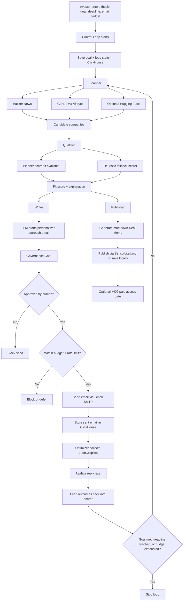

```mermaid
flowchart TD
    A[Investor enters thesis, goal, deadline, email budget] --> B[Control Loop starts]
    B --> C[Save goal + loop state in ClickHouse]

    C --> D[Scanner]
    D --> D1[Hacker News]
    D --> D2[GitHub via Airbyte]
    D --> D3[Optional Hugging Face]
    D1 --> E[Candidate companies]
    D2 --> E
    D3 --> E

    E --> F[Qualifier]
    F --> F1[Pioneer scorer if available]
    F --> F2[Heuristic fallback scorer]
    F1 --> G[Fit score + explanation]
    F2 --> G

    G --> H[Writer]
    H --> I[LLM drafts personalized outreach email]

    I --> J[Governance Gate]
    J --> K{Approved by human?}

    K -- No --> L[Block send]
    K -- Yes --> M{Within budget + rate limit?}

    M -- No --> N[Block or defer]
    M -- Yes --> O[Send email via Gmail SMTP]

    O --> P[Store sent email in ClickHouse]
    P --> Q[Optimizer collects opens/replies]
    Q --> R[Update reply rate]
    R --> S[Feed outcomes back into scorer]

    S --> T{Goal met, deadline reached, or budget exhausted?}
    T -- No --> D
    T -- Yes --> U[Stop loop]

    G --> V[Publisher]
    V --> W[Generate markdown Deal Memo]
    W --> X[Publish via Senso/cited.md or save locally]
    X --> Y[Optional x402 paid access gate]
```